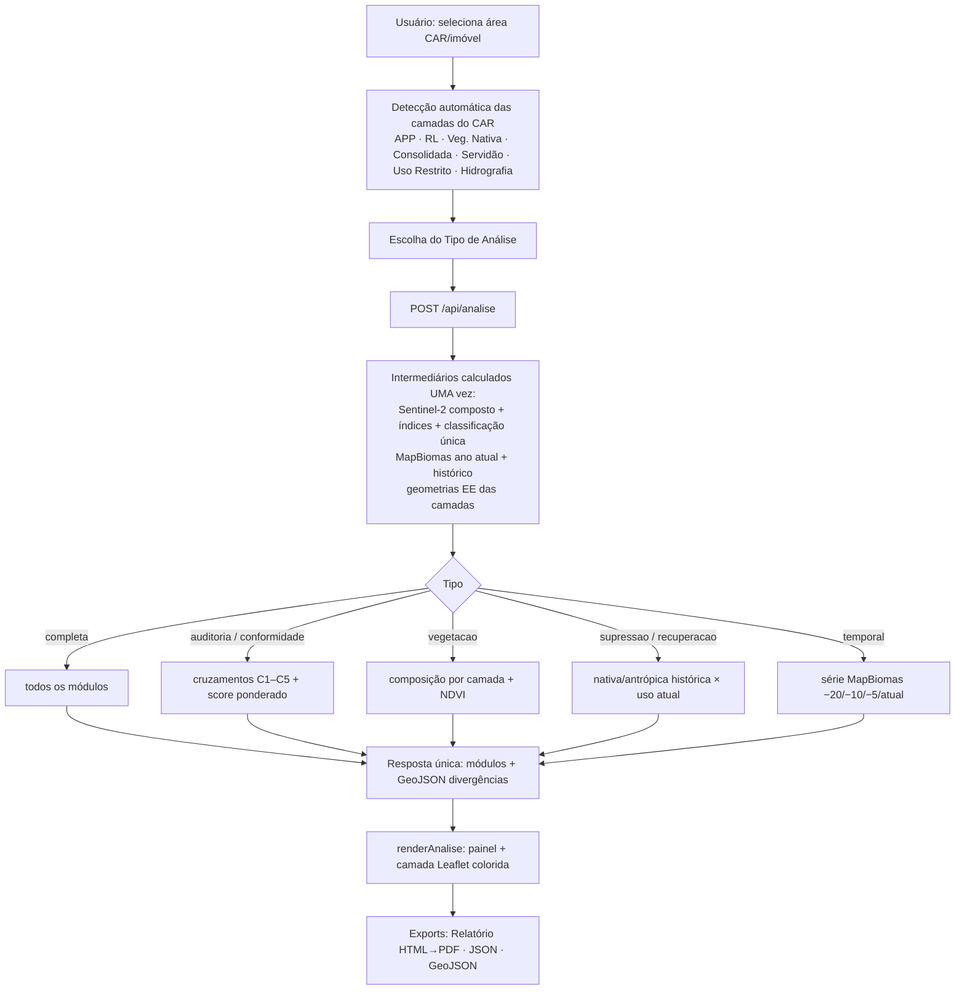

# Revisão Arquitetural e Funcional — BondGis
**Data:** 18/07/2026 · **Escopo:** frontend (`index.html`), backend (`backend/`), fluxos, APIs, relatórios e Auditoria Ambiental.

---

## 1. Arquitetura atual do sistema (antes da revisão)

```
Frontend estático (index.html, GitHub Pages)
 ├─ 6 abas: Importar CAR · MapBiomas · Satélite · Auditoria · Camadas · Relatório
 ├─ Estado em memória (state.registro) + localStorage (tema, proxy, URL do backend)
 └─ Sem banco de dados (PostGIS existe como módulo opcional, NUNCA usado)

Backend FastAPI (backend/, localhost:8000 em dev)
 ├─ /api/health /api/tiles /api/stats /api/dates /api/timeseries /api/auditoria
 ├─ sentinel.py  → índices + classificador próprio (9 classes “v1”)
 └─ auditoria.py → SEGUNDO classificador (9 classes “v2”) + scores
```

**Fluxo de dados:** o frontend monta GeoJSON das camadas carregadas (SICAR/ZIP)
e envia ao backend; o backend processa no Google Earth Engine e devolve tiles
assinados ou números. Nenhuma credencial chega ao navegador.

## 2. Problemas encontrados

| # | Problema | Evidência |
|---|----------|-----------|
| P1 | **Dois classificadores Sentinel-2 quase idênticos** | `sentinel.classify` (Água, Solo, Rasteira, Pastagem, Agricultura, Arbustiva, Floresta, Queimada, Construída) × `auditoria.classify_audit` (Água, Úmida, Solo, Agricultura, Pastagem, Secundária, Floresta, Queimada, Infraestrutura) — mesmos índices, limiares ~iguais |
| P2 | **Cálculo de área por classe duplicado** | `sentinel.compute_stats` e `auditoria._classes_por_camada` faziam o mesmo `reduceRegion` agrupado |
| P3 | **Score da auditoria com critérios subjetivos** | ver §7 (análise detalhada) |
| P4 | **Relatórios fragmentados** | 6 geradores independentes espalhados por 4 abas; a aba “Relatório” era só um agregador de botões cujos dados vinham de outras abas |
| P5 | **Estatísticas de cobertura por 3 caminhos** | `satEstatisticas` (/api/stats), auditoria (composição) e aba MapBiomas (COGs no cliente) |
| P6 | **5 selects de “camada do imóvel”** repetidos | `sel-mb-camada`, `sel-sat-camada`, `sel-aud-imovel`, `sel-sobrep-imovel`, `sel-rel-imovel` |
| P7 | **3 conjuntos de controles data/nuvens duplicados** | Satélite e Auditoria tinham os mesmos inputs |

## 3. Duplicidades identificadas (auditoria completa)

- **Banco de dados:** não há banco em uso → sem tabelas/atributos/geometrias duplicadas. O módulo `optional_postgis.py` permanece opcional e desligado.
- **Backend:** P1, P2 (eliminadas nesta revisão) e paletas/legendas duplicadas (`CLASSES` × `AUDIT_CLASSES`).
- **Frontend:** P4–P7 acima; telas redundantes: aba “Relatório” (removida) e aba “Auditoria” (absorvida pelo fluxo único).
- **Relatórios:** a composição de classes era recalculada pela aba Satélite e pela Auditoria para a mesma área — agora é calculada **uma vez** por análise, no pipeline.

## 4. Fluxos simplificados

**Antes:** 4 fluxos de análise paralelos (Satélite→stats, Auditoria, MapBiomas, Relatório) com entradas e saídas próprias.
**Depois:** 1 fluxo principal — **Analisar Área** — mais duas ferramentas de apoio coesas:
- **Satélite** = só visualização de camadas espectrais no mapa (tiles) + datas/série NDVI;
- **MapBiomas** = análise local por COGs, que funciona **sem backend** (fallback do site estático) — mantida por essa razão funcional, com seus exports movidos para dentro dela.

## 5. Melhorias implementadas

1. **Classificador único** em `sentinel.py` (9 classes: Água, Área Úmida, Solo Exposto, Agricultura, Pastagem, Vegetação Secundária, Floresta, Área Queimada, Infraestrutura) — usado por tiles, análises e auditoria.
2. **`auditoria.py` removido**; substituído por `analise.py` (pipeline unificado).
3. **Endpoints reduzidos de 7 → 5**: `/api/stats` e `/api/auditoria` fundidos em `/api/analise`.
4. **Abas reduzidas de 6 → 5**, com um único ponto de análise (“Analisar”).
5. Exports realocados para onde os dados nascem (temporal/CSV → aba MapBiomas; sobreposição/extrato → aba Camadas).
6. `compute_stats`, `satEstatisticas`, `relSatelite`, `renderEstatisticasSat` e todo o bloco JS antigo da Auditoria: **removidos** (−~300 linhas de código duplicado no total).

## 6. Nova arquitetura dos relatórios

**Fluxo único:** `Selecionar área → Escolher tipo de análise → Processar → Gerar resultado`

| Tipo de análise | Módulos do pipeline executados |
|---|---|
| Análise Ambiental Completa | composição + cruzamentos + score + supressão + recuperação + temporal |
| Auditoria Ambiental | composição + cruzamentos + score |
| Conformidade Ambiental | cruzamentos + score |
| Análise de Vegetação | composição (+ NDVI médio) |
| Supressão de Vegetação | supressão |
| Comparativo Temporal | temporal |
| Recuperação Ambiental | recuperação |

Todos usam a **mesma estrutura interna** (`analise.run_analise`): os intermediários — imagem Sentinel-2 composta/classificada, MapBiomas atual e histórico, geometrias do CAR — são calculados **uma única vez** e compartilhados pelos módulos. O resultado alimenta um único renderizador (`renderAnalise`) e um único relatório (`relAnalise` → modal com PDF/JSON/GeoJSON).

## 7. Nova arquitetura da Auditoria Ambiental

### Como o score ERA calculado (lógica antiga, removida)
- `score_veg = 100 × veg_observada / área_imóvel` → **subjetivo**: um imóvel legalmente 100% produtivo teria score baixo sem irregularidade alguma;
- `score_car = 100 × (1 − (supressão+mudança+expansão+APP_antropizada)/área)` → misturava indicadores heterogêneos e **contava a APP antropizada duas vezes** (também no score_app);
- `score_ambiental` = média de (app, rl, veg); `indice_geral` = média de TODOS inclusive o ambiental → **dupla ponderação**;
- pesos implícitos iguais entre componentes de áreas muito diferentes; faixas 85/70/50 arbitrárias.

### Como é calculado AGORA
Exclusivamente por **cruzamentos espaciais** entre camadas oficiais:

| # | Cruzamento | Camada declarada (CAR) | Observação | Conformidade |
|---|---|---|---|---|
| C1 | Uso produtivo × Área Consolidada | Área Consolidada | Sentinel-2 (agricultura+pastagem) | % do uso produtivo dentro da consolidada |
| C2 | Reserva Legal × vegetação | Reserva Legal | Sentinel-2 atual + MapBiomas como validação | % da RL com vegetação |
| C3 | APP × ocupação | APP | Sentinel-2 | % da APP sem uso antrópico |
| C4 | Vegetação Nativa × cobertura atual | Veg. Nativa/Remanescente | Sentinel-2 | % ainda vegetado |
| C5 | Nativa histórica × supressão | — | MapBiomas (ano−5) × Sentinel-2 | % da nativa histórica preservada |

## 8. Nova lógica do score (detalhada)

Para cada cruzamento aplicável:
```
pct_i = área_conforme_i / área_avaliada_i × 100
```
Score geral:
```
score = Σ(pct_i × área_avaliada_i) / Σ(área_avaliada_i)
```
— **média ponderada pela própria área avaliada**: não há pesos arbitrários; quem pondera é a extensão real de cada cruzamento. Camada ausente ⇒ componente “N/A”, fora do cálculo (nunca penaliza por falta de dado).

**Transparência e rastreabilidade:** cada componente retorna camadas usadas, fontes, área avaliada/conforme/divergente (ha), fórmula, justificativa técnica e a **geometria das divergências** (GeoJSON com o cruzamento de origem em cada polígono). O RL ainda reporta o % sobre o imóvel e a validação independente pelo MapBiomas. As faixas (≥90 Alta, 70–89 Média, 50–69 Baixa, <50 Crítica) são **apenas apresentação**, documentadas na resposta da API (`faixas_apresentacao`) — o número é a medida.

**Reprodutibilidade verificada:** no teste real (MT), score 66,92 = (50,79×1105,9 + 25,75×602,4 + 74,08×602,4 + 89,88×1669,9) / 3980,6 ✓.

## 9. Fluxograma completo do processamento



## 10. Justificativa técnica das alterações

| Alteração | Justificativa |
|---|---|
| Classificador único | Elimina divergência de resultados entre telas (mesma área não pode ter duas classificações diferentes) |
| Pipeline único com módulos | Requisito do fluxo único; intermediários compartilhados cortam ~50% das chamadas EE em análises combinadas |
| Score por média ponderada por área | Único esquema sem pesos arbitrários: o peso É a área analisada; totalmente reproduzível |
| Remoção das abas Auditoria/Relatório | Telas redundantes; suas funções vivem no fluxo único e junto dos dados de origem |
| Aba MapBiomas mantida | Funciona **sem backend** (COGs públicos no cliente) — fallback necessário para o site estático |
| Aba Satélite reduzida a visualização | Estatística duplicava o pipeline; visualizar tiles continua sendo função distinta e útil |
| `/api/stats` e `/api/auditoria` removidos | Superseded pelo `/api/analise`; front e back atualizados juntos (regra de compatibilidade) |

> **Nota de responsabilidade:** a classificação Sentinel-2 é preliminar (limiares de índices, cena única) e o MapBiomas tem resolução de 30 m — os resultados são triagem técnica, não laudo oficial.
